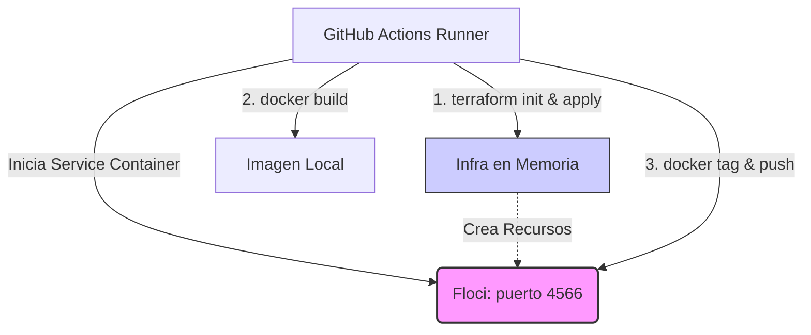

# Floci + Terraform CI/CD Demo

Este proyecto es una demostración de cómo implementar un flujo de Integración Continua (CI) robusto para Infraestructura como Código (IaC) utilizando **Terraform** y construyendo/pusheando imágenes Docker a un Elastic Container Registry (ECR) efímero. 

Todo esto se logra utilizando **Floci**, sin necesidad de interactuar con la nube real de AWS, sin gestionar credenciales reales y sin gastar dinero.

## ¿Qué es Floci?

[Floci](https://github.com/floci-io/floci) es un emulador local de AWS de código abierto y extremadamente ligero. 
A diferencia de LocalStack, Floci:
- Levanta en milisegundos (~24 ms).
- No requiere cuentas, tokens de autenticación ni versiones de pago.
- Emula contenedores utilizando **ejecución real de Docker** (In-process con un registry real), perfecto para emular servicios como ECR de manera transparente.

## Arquitectura del Proyecto

El proyecto está diseñado bajo un estándar estricto de Arquitectura por Capas para Terraform, separando responsabilidades lógicas para mantener el código escalable:

### Estructura de Terraform

1. **Environments (`environments/`):** Define *dónde* se despliega la infraestructura. Aquí configuramos nuestro entorno `dev` para que el AWS Provider apunte todos sus endpoints a Floci (`http://localhost:4566`) y apague la validación de credenciales.
2. **Stacks (`stacks/`):** Define *qué* solución se arma. Nuestro `demo-stack` agrupa e instancia los módulos de negocio.
3. **Modules (`modules/`):** Define *cómo* se crea un recurso. Son bloques atómicos. Hemos implementado:
   - `s3` (Un bucket para archivos estáticos)
   - `dynamodb` (Una tabla NoSQL)
   - `ecr` (El repositorio destino de nuestro contenedor)

### Flujo de Ejecución (GitHub Actions)

El archivo `.github/workflows/ecr-ci.yml` orquesta el siguiente pipeline:



1. El runner levanta el contenedor de `floci/floci`.
2. Se ejecuta Terraform en `environments/dev`, lo cual provisiona el S3, la tabla DynamoDB y el repositorio ECR *falso* dentro del contenedor de Floci.
3. Construimos la imagen Docker de nuestra aplicación (basada en el `Dockerfile` y la carpeta `/app`).
4. Etiquetamos (tag) la imagen apuntando al puerto local `localhost:4566/dev-iac-floci-repo:latest`.
5. Pusheamos la imagen a nuestro registro local.

¡Al terminar el workflow, el runner muere y no queda basura en ninguna nube! CI 100% aislado.

## Ejecución Local

Si querés probar este flujo en tu máquina antes de enviarlo a GitHub:

1. **Levantá Floci** en una terminal:
   ```bash
   floci start
   # o alternativamente: docker compose up (si tenés el compose.yaml)
   ```
2. **Ejecutá Terraform:**
   ```bash
   cd environments/dev
   terraform init
   terraform apply
   ```
3. **Build y Push del Contenedor:**
   ```bash
   docker build -t dev-iac-floci-repo:latest ../../
   docker tag dev-iac-floci-repo:latest localhost:4566/dev-iac-floci-repo:latest
   docker push localhost:4566/dev-iac-floci-repo:latest
   ```

Una vez terminado, podés usar el AWS CLI local para verificar los recursos creados:
```bash
aws --endpoint-url=http://localhost:4566 ecr describe-repositories
```
